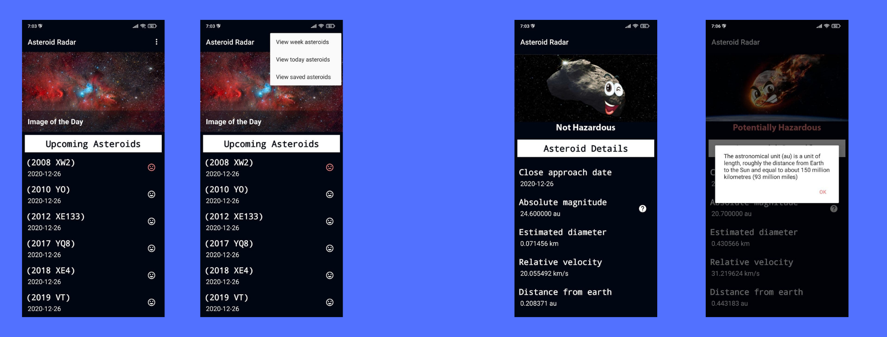
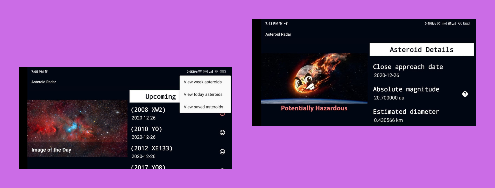
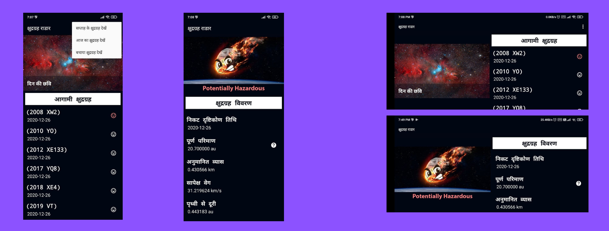

# Asteroid Radar App

## What does this app do ?

This app fetches asteroid list and picture of the day from NASA's API and displays them.

## Features

- App is completely in **Kotlin**
- App uses **DataBinding** and **ViewBinding**
- App Architecture - **MVVM** _(LiveData, Repository)_
- App uses **SQLite Database** to store the information
- **Caching** is used to store and show the data
- **WorkManager** is used to _fetch and destroy data from database periodically_
- App has different layout for **Landscape** and **Portrait**
- App is available in **Hindi** and **English**

## Libraries Used

- **Retrofit** - For interacting with API
- **Picasso** - For displaying the image
- **SafeArgs** - For type safety in kotlin

# App Demo

[](https://www.youtube.com/watch?v=nhtb_iGSbc4)

# Screenshots






# License
```
MIT License

Copyright (c) 2020 Nishit Gupta

Permission is hereby granted, free of charge, to any person obtaining a copy
of this software and associated documentation files (the "Software"), to deal
in the Software without restriction, including without limitation the rights
to use, copy, modify, merge, publish, distribute, sublicense, and/or sell
copies of the Software, and to permit persons to whom the Software is
furnished to do so, subject to the following conditions:

The above copyright notice and this permission notice shall be included in all
copies or substantial portions of the Software.

THE SOFTWARE IS PROVIDED "AS IS", WITHOUT WARRANTY OF ANY KIND, EXPRESS OR
IMPLIED, INCLUDING BUT NOT LIMITED TO THE WARRANTIES OF MERCHANTABILITY,
FITNESS FOR A PARTICULAR PURPOSE AND NONINFRINGEMENT. IN NO EVENT SHALL THE
AUTHORS OR COPYRIGHT HOLDERS BE LIABLE FOR ANY CLAIM, DAMAGES OR OTHER
LIABILITY, WHETHER IN AN ACTION OF CONTRACT, TORT OR OTHERWISE, ARISING FROM,
OUT OF OR IN CONNECTION WITH THE SOFTWARE OR THE USE OR OTHER DEALINGS IN THE
SOFTWARE.
```
